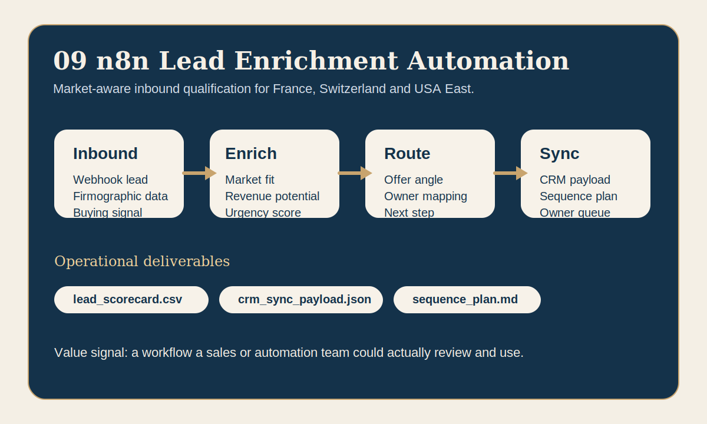

# n8n Lead Enrichment Automation



A lead-qualification workflow that enriches inbound opportunities, scores them for France, Switzerland and the US East Coast, then writes CRM-ready and outreach-ready outputs.

## Business problem

Inbound leads often arrive without enough context for an efficient commercial response.
The operational need is to route them quickly toward the right offer angle, the right owner and the right next step.

## What the program does

- enriches and scores inbound leads across industry, geography, department, urgency and revenue potential,
- maps each signal to an offer angle that matches the showcase capabilities,
- routes the best leads toward the right owner and next action,
- writes outputs that could feed CRM, outreach planning and sales review,
- keeps the logic readable enough to map directly to an n8n workflow.

## Operational outputs

- `qualification_report.md`
  Ranked review of the qualified lead set.
- `lead_scorecard.csv`
  Full scoring table with owner and follow-up fields.
- `crm_sync_payload.json`
  Top-priority payload for CRM or orchestration sync.
- `sequence_plan.md`
  Outreach guidance for high, medium and low-priority cohorts.

## Market fit

- France: dashboard automation, lead qualification and workflow acceleration use cases.
- Switzerland: claims, finance and document-heavy internal automation opportunities.
- USA East: operations transformation, analytics copilot and governance-aware automation programs.

## Run

```bash
python3 app.py
python3 test_lead_enrichment.py
```

## Review in 60 seconds

Open `qualification_report.md`, then `lead_scorecard.csv`, then `crm_sync_payload.json`.
That sequence shows the value quickly:
- concrete qualification logic,
- market-aware scoring,
- CRM-ready routing,
- immediate sales follow-up assets.
