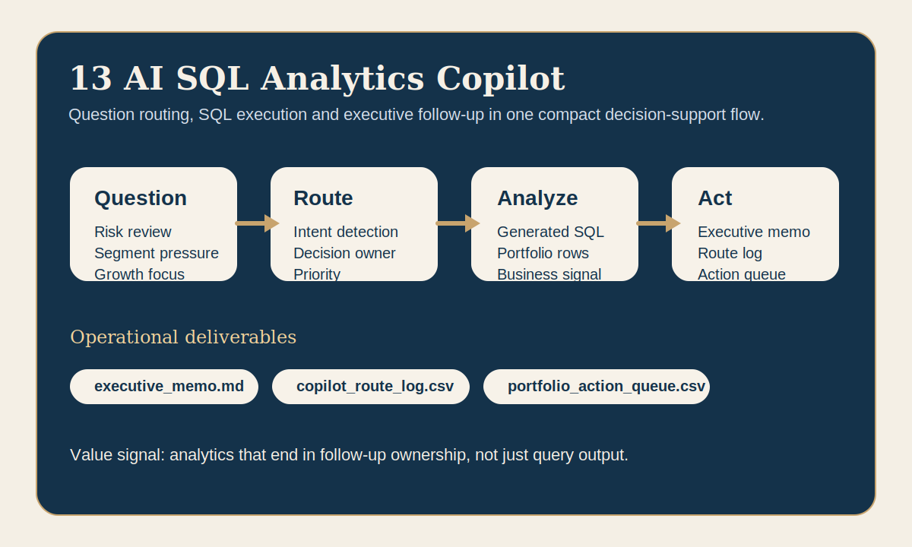

# AI SQL Analytics Copilot



A decision-support copilot that turns business questions into SQL, interprets the results and produces management-ready follow-up outputs.

## Business problem

Business stakeholders often know the question they need answered but do not want raw SQL, notebook work or fragmented KPI extracts.
They need a compact path from management question to decision-ready output.

## What the program does

- routes each business question to an analytical intent,
- generates the SQL view required for that intent,
- executes the logic on a structured account portfolio,
- translates the result into a summary, operating note and next step,
- writes reusable follow-up artifacts for leadership and delivery teams.

## Operational outputs

- `copilot_report.md`
  Full question-to-SQL-to-answer walkthrough.
- `executive_memo.md`
  Short leadership briefing with headline signals and agenda.
- `copilot_route_log.csv`
  Question routing, priority, owner and next-step trace.
- `portfolio_action_queue.csv`
  Actionable queue for retention, segment protection and expansion.

## Market fit

- France: analytics engineering, Power BI framing, business-to-data translation and AI-assisted analytics.
- Switzerland: finance, insurance and operational portfolios that need SQL reasoning plus management clarity.
- USA East: enterprise analytics copilots, decision support and structured portfolio review with clear ownership.

## Run

```bash
python3 app.py
python3 test_copilot.py
```

## Review in 60 seconds

Open `executive_memo.md`, then `copilot_route_log.csv`, then `portfolio_action_queue.csv`.
That path shows the strongest signal quickly:
- business question routing,
- SQL-backed reasoning,
- readable leadership synthesis,
- follow-up outputs that a client team could actually use.
