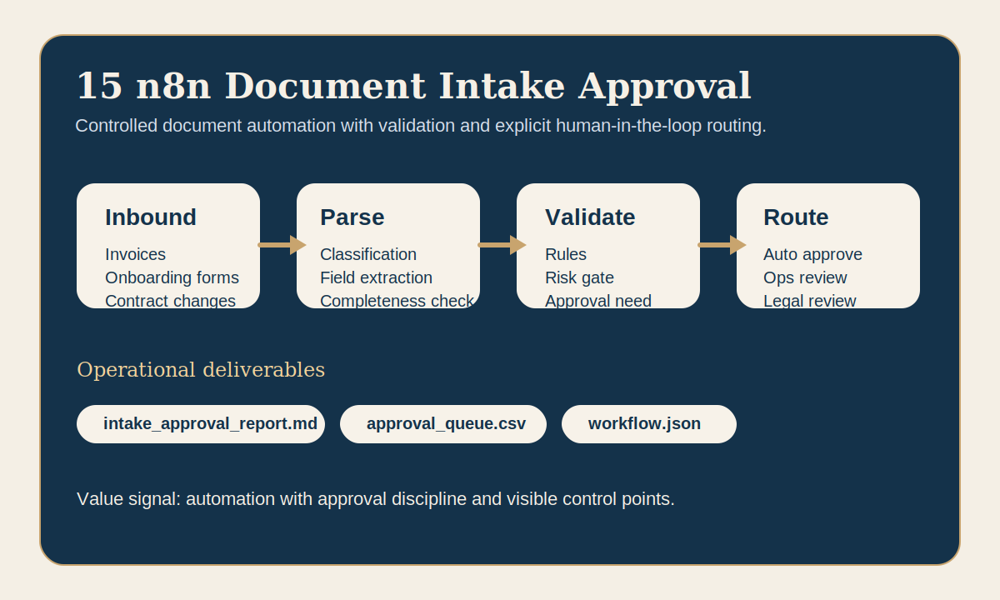

# n8n Document Intake Approval



A document-automation workflow that classifies inbound files, validates required fields and routes each case to automatic or human approval.

## Business problem

Document-heavy operations lose time when inbound files are handled manually, inconsistently or without a clear approval path.
The practical need is not "more AI". The need is a controlled workflow with readable decisions.

## What the program does

- classifies invoices, onboarding requests and contract changes,
- extracts key fields from the inbound payload,
- validates whether the document is complete enough to proceed,
- routes each case toward automatic approval, operational review or legal approval,
- writes outputs that operations teams could review immediately.

## Operational outputs

- `intake_approval_report.md`
  Classified decisions, validation findings and approval rationale.
- `approval_queue.csv`
  Queue ready for finance, operations or legal teams.
- `workflow.json`
  Compact n8n-style orchestration view of the flow.

## Market fit

- France: operations, finance and document-heavy internal workflows where AI automation must stay controlled.
- Switzerland: compliance-sensitive environments, approvals and audit-friendly document handling.
- USA East: enterprise workflow automation with explicit handoff to human reviewers when risk rises.

## Run

```bash
python3 app.py
```

## Review in 60 seconds

Open `intake_approval_report.md`, then `approval_queue.csv`, then `workflow.json`.
That makes the value obvious:
- clear document triage,
- explicit validation rules,
- human-in-the-loop control,
- realistic workflow automation rather than a vague AI demo.
