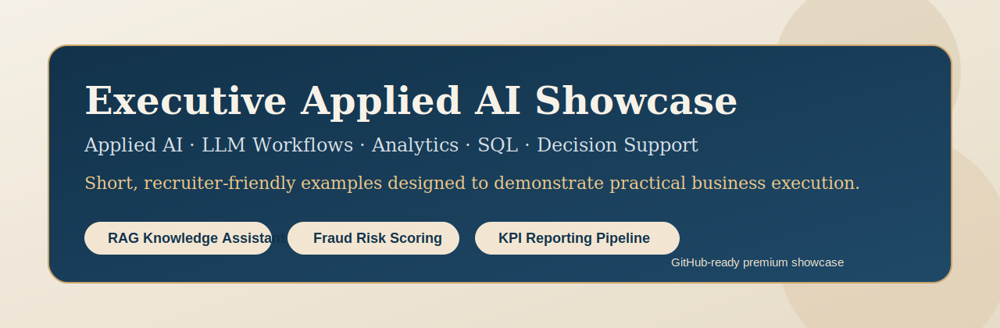

<p align="center">
  
</p>

# Executive Applied AI Showcase

Selected Applied AI, data, cloud data platform governance, n8n automation and agentic workflow examples built to demonstrate practical business execution with clarity, discipline and usable outputs.

## Public Pages

The GitHub Pages surface now has two layers:

- corporate landing page at `docs/index.html`
- technical proof hub at `docs/showcase.html`

Published URLs:

- `https://vinbourg.github.io/executive-applied-ai-showcase/`
- `https://vinbourg.github.io/executive-applied-ai-showcase/showcase.html`

The landing page presents the `Data Crunch Limited` positioning and links into the technical proof surface.

## Static Demo Hub

The repository now includes a static demo hub under:

- `docs/showcase.html`
- `docs/kpi-demo.html`
- `docs/sql-copilot.html`
- `docs/lead-automation.html`
- `docs/market-signals.html`

The hub now also includes one dedicated item page per showcase folder under `docs/*.html`, all linked directly from `docs/showcase.html`.

It is designed to give recruiters or clients a faster visual read of the strongest examples without installing anything locally.
Deployment is wired for GitHub Pages through:

- `.github/workflows/deploy-pages.yml`

## Positioning

This repository is designed as a compact executive showcase rather than a broad technical sandbox.

It presents short, high-signal demos illustrating how I approach market-relevant AI and data work:
- define a concrete use case,
- structure the logic cleanly,
- keep the implementation readable,
- deliver outputs that are directly useful to business, operations or decision-makers.

The objective is not to simulate a large production platform. The objective is to make judgment, delivery style, technical clarity and business relevance visible within a very short review window.

## Client Value Lens

These examples are designed to answer a practical question:

`What does this produce that a client or business team can actually use?`

Across the repository, the recurring pattern is:
- take a concrete operational problem,
- turn it into structured logic,
- produce a usable output such as a report, action plan, queue, dashboard, scorecard or routing payload.

For a repository-wide view of business outcomes and deliverables, see:
- `CLIENT_VALUE_MAP.md`

## Repository Scope

The repository is intentionally balanced across five themes:

- Applied AI and LLM workflows
- Predictive analytics and decision support
- Data engineering and governance
- AI automation with n8n-style workflow design
- Agentic task routing and executive briefing logic

## Intended Audience

This repository is especially relevant for:
- recruiters reviewing Applied AI, GenAI, analytics or AI automation profiles,
- recruiters reviewing data platform, analytics engineering or governance-oriented profiles,
- hiring managers looking for practical execution rather than generic experimentation,
- companies interested in AI assistants, trusted data products, n8n workflows, decision support, reporting automation and structured agentic design.

## Recommended Review Paths

If you want the fastest cross-section of the repository, start here:

1. `01_RAG_Knowledge_Assistant`
2. `13_AI_SQL_Analytics_Copilot`
3. `09_n8n_Lead_Enrichment_Automation`
4. `15_n8n_Document_Intake_Approval`
5. `16_Cloud_Data_Platform_Governance`
6. `14_LLM_Evaluation_Guardrails`

## Flagship Projects

If the objective is to assess the most market-relevant and recruiter-friendly examples first, the flagship folders are:

- `01_RAG_Knowledge_Assistant`
- `13_AI_SQL_Analytics_Copilot`
- `09_n8n_Lead_Enrichment_Automation`
- `15_n8n_Document_Intake_Approval`
- `16_Cloud_Data_Platform_Governance`
- `14_LLM_Evaluation_Guardrails`
- `08_Agentic_Knowledge_Routing`

If you want to review by theme:

- Data and analytics: `02_Fraud_Risk_Scoring`, `03_KPI_Reporting_Pipeline`, `06_Customer_Segmentation_Clustering`, `07_Time_Series_Forecasting`, `10_Dashboard_Brief_Generator`, `13_AI_SQL_Analytics_Copilot`
- Data engineering and governance: `16_Cloud_Data_Platform_Governance`, `04_SQL_Decision_Support`
- Applied AI and LLM workflows: `01_RAG_Knowledge_Assistant`, `05_Brochure_Content_Workflow`, `14_LLM_Evaluation_Guardrails`
- n8n automation: `09_n8n_Lead_Enrichment_Automation`, `11_n8n_AI_Support_Automation`, `15_n8n_Document_Intake_Approval`
- Agentic workflows: `08_Agentic_Knowledge_Routing`, `12_Agentic_Research_Briefing`

## Selected Work

| Folder | What it demonstrates | Business relevance |
|---|---|---|
| `01_RAG_Knowledge_Assistant` | Retrieval-first assistant design, business knowledge structuring, reusable core logic, API-ready progression | Internal knowledge assistant, support enablement, document-grounded Q&A |
| `02_Fraud_Risk_Scoring` | Supervised learning, interpretable risk scoring, compact Python modeling | Fraud analytics, transaction monitoring, predictive decision support |
| `03_KPI_Reporting_Pipeline` | KPI automation, reporting outputs, executive-style dashboard generation | Operational performance, reporting visibility, decision support |
| `04_SQL_Decision_Support` | Business-oriented SQL reasoning, prioritization logic, compact data mart thinking | Account review, action prioritization, structured monitoring |
| `05_Brochure_Content_Workflow` | Structured prompt design, content workflow logic, output templating | AI-assisted content production, marketing enablement, workflow automation |
| `06_Customer_Segmentation_Clustering` | Unsupervised segmentation, portfolio profiling, interpretable cluster logic | Customer segmentation, market studies, account prioritization |
| `07_Time_Series_Forecasting` | Trend-aware demand forecasting, compact planning logic, operational time-series reasoning | Workload forecasting, support planning, staffing anticipation |
| `08_Agentic_Knowledge_Routing` | Agentic decomposition, routing between retrieval and synthesis, explainable planning | Knowledge work automation, AI task routing, structured business assistance |
| `09_n8n_Lead_Enrichment_Automation` | n8n-oriented AI automation, market-aware lead scoring, CRM sync and outreach sequencing | Lead enrichment, sales enablement and workflow automation with ownership |
| `10_Dashboard_Brief_Generator` | KPI scoping, stakeholder translation, analytics briefing outputs | Power BI preparation, dashboard scoping, analytics delivery framing |
| `11_n8n_AI_Support_Automation` | AI ticket classification, routing logic, operational automation design | Support automation, AI-assisted triage, response drafting |
| `12_Agentic_Research_Briefing` | Multi-step research planning, executive synthesis logic, structured briefing outputs | Pre-meeting research, advisory preparation, decision-support briefing |
| `13_AI_SQL_Analytics_Copilot` | Business-question routing, SQL generation logic, executive memo creation and action-queue outputs | AI-assisted analytics, SQL copilot and decision-ready portfolio follow-up |
| `14_LLM_Evaluation_Guardrails` | Output scoring, groundedness checks, policy control and fallback routing | LLM quality control, guardrails, production-minded GenAI delivery |
| `15_n8n_Document_Intake_Approval` | Document classification, field extraction, validation rules and human-in-the-loop approval routing | Document automation, internal approvals, compliance-friendly workflow orchestration |
| `16_Cloud_Data_Platform_Governance` | Data quality rules, governance checks, release readiness and cloud-style platform discipline | Data engineering, governance, trusted BI delivery and cloud platform operations |

## Market Alignment

This repository has been reviewed against current demand signals visible on `April 19, 2026` for:
- France
- Switzerland
- USA East Coast

The strongest cross-market pattern is clear:
- AI assistants, RAG and agentic workflows are in demand,
- but so are platform discipline, data quality, governance and cloud-ready delivery,
- especially in regulated, enterprise or multi-stakeholder environments.

For the detailed rationale and source links, see:
- `MARKET_ALIGNMENT_2026.md`

## What This Repository Signals

This showcase is meant to reflect a profile able to combine:
- Applied AI and LLM workflow design,
- business-oriented analytics,
- SQL-based reasoning,
- LLM evaluation and guardrail discipline,
- data platform, governance and release-readiness thinking,
- n8n-style automation thinking,
- agentic planning and synthesis,
- compact and disciplined implementation.

In practical terms, it signals an ability to move from business need to usable prototype without losing clarity, structure or value orientation.

## Local Run

The demos run with standard Python 3 and the standard library only.

```bash
python3 01_RAG_Knowledge_Assistant/app.py
python3 02_Fraud_Risk_Scoring/app.py
python3 03_KPI_Reporting_Pipeline/app.py
python3 04_SQL_Decision_Support/app.py
python3 05_Brochure_Content_Workflow/app.py
python3 06_Customer_Segmentation_Clustering/app.py
python3 07_Time_Series_Forecasting/app.py
python3 08_Agentic_Knowledge_Routing/app.py
python3 09_n8n_Lead_Enrichment_Automation/app.py
python3 10_Dashboard_Brief_Generator/app.py
python3 11_n8n_AI_Support_Automation/app.py
python3 12_Agentic_Research_Briefing/app.py
python3 13_AI_SQL_Analytics_Copilot/app.py
python3 14_LLM_Evaluation_Guardrails/app.py
python3 15_n8n_Document_Intake_Approval/app.py
python3 16_Cloud_Data_Platform_Governance/app.py
```

## Optional Premium Entry Points

For a more polished demonstration format, the repository also includes optional web-oriented entry points:

- `01_RAG_Knowledge_Assistant/fastapi_app.py`
- `03_KPI_Reporting_Pipeline/streamlit_app.py`
- `docs/index.html`
- `docs/kpi-demo.html`
- `docs/sql-copilot.html`
- `docs/lead-automation.html`
- `docs/*-*.html` item pages linked from the hub
- `requirements_optional.txt`

These optional files expose the same underlying business logic through API, dashboard and static-demo interfaces.

## Review Note

This repository is not positioned as a production system.
It is a selective showcase of significant know-how consistent with my CV:
- business-oriented Applied AI,
- LLM workflows and AI enablement,
- LLM evaluation and guardrail logic,
- predictive analytics and fraud-related reasoning,
- KPI reporting and dashboard framing,
- n8n-style AI automation,
- agentic decision-support workflows.

## Additional Reading

- `RECRUITER_REVIEW_GUIDE.md`
- `SHOWCASE_CV_ALIGNMENT_FR.md`
- `CLIENT_VALUE_MAP.md`
- `MARKET_ALIGNMENT_2026.md`
- `PUBLISH_TO_GITHUB.md`
